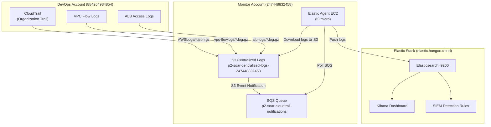

# Walkthrough: Hệ thống Thu thập Log Tập trung → Elastic SIEM

Tài liệu này tổng hợp toàn bộ kiến trúc, cấu hình và trạng thái hoạt động của pipeline thu thập log từ AWS Landing Zone (3 accounts) vào Elasticsearch/Kibana để phát hiện mối đe dọa.

---

## 1. Kiến trúc Tổng quan



---

## 2. Chi tiết Cấu hình từng Nguồn Log

### A. CloudTrail Logs → S3 → Elastic ✅

| Hạng mục | Giá trị |
|---|---|
| Trail Name | Organization Trail (Master Account) |
| S3 Path | `s3://p2-soar-centralized-logs-247448832458/AWSLogs/` |
| File Format | `.json.gz` |
| SQS Filter | `prefix=AWSLogs/`, `suffix=.json.gz` |
| Trạng thái | ✅ Hoạt động, 1467+ documents đã index |

- **Terraform file**: [cloudtrail.tf](file:///d:/Project-2-Landing-Zone/environments/devops-account/cloudtrail.tf)
- CloudTrail ghi log tất cả management events từ mọi account trong Organization
- S3 Bucket Policy cho phép CloudTrail service ghi vào cả Organization path và Master Account path

### B. VPC Flow Logs → S3 → Elastic ✅

| Hạng mục | Giá trị |
|---|---|
| Flow Log | `devops-vpc-flowlog` (ALL traffic) |
| S3 Path | `s3://p2-soar-centralized-logs-247448832458/vpc-flowlogs/` |
| File Format | `.log.gz` |
| SQS Filter | `prefix=vpc-flowlogs/`, `suffix=.log.gz` |
| Trạng thái | ✅ Đã bật, SQS notification đã cấu hình |

- **Terraform file**: [vpc-flowlogs.tf](file:///d:/Project-2-Landing-Zone/environments/devops-account/vpc-flowlogs.tf)
- Flow logs ghi trực tiếp cross-account sang S3 bucket ở Monitor Account
- S3 Bucket Policy cho phép `delivery.logs.amazonaws.com` từ cả DevOps Account và Master Account

### C. ALB Access Logs → S3 → Elastic ✅

| Hạng mục | Giá trị |
|---|---|
| ALB | `p2-soar-devops-alb` |
| S3 Path | `s3://p2-soar-centralized-logs-247448832458/alb-logs/` |
| File Format | `.log.gz` |
| SQS Filter | `prefix=alb-logs/`, `suffix=.log.gz` |
| Trạng thái | ✅ Đã bật, SQS notification đã cấu hình |

- **Terraform file**: [alb.tf](file:///d:/Project-2-Landing-Zone/environments/devops-account/alb.tf) (line 13: `enabled = true`)
- S3 Bucket Policy cho phép `logdelivery.elasticloadbalancing.amazonaws.com`

---

## 3. Pipeline Trung gian (Monitor Account)

### A. S3 Centralized Logs Bucket

- **Terraform file**: [s3-logs.tf](file:///d:/Project-2-Landing-Zone/environments/monitor-account/s3-logs.tf)
- Bucket: `p2-soar-centralized-logs-247448832458`
- Versioning: Enabled
- Encryption: AES256 (SSE-S3)
- Public Access: Blocked hoàn toàn

**Bucket Policy cho phép ghi từ 3 sources:**

| Service | Action | Path |
|---|---|---|
| `cloudtrail.amazonaws.com` | `s3:PutObject` | `AWSLogs/*` |
| `delivery.logs.amazonaws.com` | `s3:PutObject` | `vpc-flowlogs/*` |
| `logdelivery.elasticloadbalancing.amazonaws.com` | `s3:PutObject` | `alb-logs/*` |

### B. SQS Queue & Event Notifications

- **Terraform file**: [sqs-notifications.tf](file:///d:/Project-2-Landing-Zone/environments/monitor-account/sqs-notifications.tf)
- Queue: `p2-soar-cloudtrail-notifications`
- Message retention: 24 giờ
- Visibility timeout: 5 phút

**3 S3 Event Notification rules:**

| # | Prefix | Suffix | Loại log |
|---|---|---|---|
| 1 | `AWSLogs/` | `.json.gz` | CloudTrail |
| 2 | `vpc-flowlogs/` | `.log.gz` | VPC Flow Logs |
| 3 | `alb-logs/` | `.log.gz` | ALB Access Logs |

### C. Elastic Agent EC2

- **Terraform file**: [elastic-agent-ec2.tf](file:///d:/Project-2-Landing-Zone/environments/monitor-account/elastic-agent-ec2.tf)
- Instance type: `t3.small` (2 GB RAM, nâng cấp từ `t3.micro` để tránh thiếu RAM/kswapd0 treo agent), AMI: Amazon Linux 2023
- Elastic Agent version: `9.3.3`
- Fleet URL: `https://172.25.1.29:8220` (NAT redirect → `elastic.hungcx.cloud`)
- Security Group: Outbound only (không có inbound)
- Quản lý qua SSM (không cần SSH/key pair)

**IAM Permissions (EC2 Instance Role):**

| Permission | Resource |
|---|---|
| `s3:GetObject`, `s3:ListBucket` | S3 Centralized Logs bucket |
| `sqs:ReceiveMessage`, `sqs:DeleteMessage`, `sqs:GetQueueAttributes`, `sqs:ChangeMessageVisibility` | SQS Queue |

**NAT Workaround:**
- Fleet Server trả về IP nội bộ `172.25.1.29` → Agent không kết nối được
- Giải pháp: `iptables` DNAT redirect `172.25.1.29:8220/9200` → `elastic.hungcx.cloud:8220/9200`
- Persistent qua systemd service `elastic-agent-nat.service`
- Script: [install-elastic-agent.sh.tpl](file:///d:/Project-2-Landing-Zone/environments/monitor-account/scripts/install-elastic-agent.sh.tpl)

---

## 4. Elastic SIEM (Kibana)

### A. Data View & Index
- Data View: **AWS CloudTrail Logs** (pattern: `logs-aws.cloudtrail-*`)
- Index: `.ds-logs-aws.cloudtrail-default-2026.05.22-000001`
- Documents: 1467+ bản ghi

### B. Dashboard
- **[Logs AWS] CloudTrail Overview**: Bản đồ địa lý, Event Outcome, Actions breakdown

### C. 5 Detection Rules đã kích hoạt

| # | Rule | Mục đích |
|---|---|---|
| 1 | AWS IAM Group Creation | Phát hiện leo thang đặc quyền |
| 2 | AWS SNS Topic Message Publish by Rare User | User bất thường gửi SNS |
| 3 | Insecure EC2 VPC SG Ingress Rule Added | Rule mở cổng nguy hiểm (0.0.0.0/0) |
| 4 | AWS CloudTrail Log Suspended | Phát hiện xóa vết |
| 5 | AWS S3 Bucket Configuration Deletion | S3 config bị xóa |

---

## 5. AI Engine & SOAR Pipeline (Phase 3-5)

### A. AI Engine (Lambda)
- Lambda: `p2-soar-ai-engine` (Python 3.12)
- Flow: Kibana Detection Rule → Webhook → Lambda → Query ES (60 events) → Amazon Bedrock (Claude Haiku 4.5) → DynamoDB
- Phân tích: MITRE ATT&CK, Root Cause Analysis (5 Whys), remediation suggestions
- Incident Store: DynamoDB `p2-soar-incidents` (TTL: 90 ngày)

### B. Remediation Lambda (Phase 4) ✅ Deployed
- Hỗ trợ Approve/Reject incident
- DynamoDB status: `Resolved` (approve) / `Rejected` (reject)

### C. Web Portal (Phase 5) ✅ Deployed
- Bảng incidents với nút Approve/Reject

> [!NOTE]
> Phase 4 & 5 đã được deploy hoàn chỉnh — giữ nguyên, không thay đổi.

---

## 6. Trạng thái Tổng hợp

| Hạng mục | Trạng thái | Ghi chú |
|---|---|---|
| CloudTrail → S3 → SQS → Elastic Agent → ES | ✅ Hoạt động | 1467+ docs đã index |
| VPC Flow Logs → S3 → SQS → Elastic Agent → ES | ✅ Pipeline sẵn sàng | SQS notification đã cấu hình |
| ALB Access Logs → S3 → SQS → Elastic Agent → ES | ✅ Pipeline sẵn sàng | SQS notification đã cấu hình |
| Web Application Logs (CloudWatch) → Elastic | ✅ Hoạt động | Data Stream: `logs-aws_logs.web-*` |
| RDS Database Logs (CloudWatch) → Elastic | ✅ Hoạt động | Data Stream: `logs-aws_logs.database-*`, Custom DB Parameter Group: `p2-soar-dev-apse1-mysql-params` (slow_query_log=1, long_query_time=1) |
| IAM cho Elastic Agent EC2 | ✅ Đầy đủ | S3 + SQS + AssumeRole permissions |
| Elastic Agent health | ✅ Healthy | Đã sửa SCP chặn vùng + nâng cấp lên `t3.small` (2 GB RAM) |
| SIEM Detection Rules | ✅ 5 rules active | Webhook → AI Engine |
| AI Engine (Lambda) | ✅ Hoạt động | Đã tích hợp Telegram Security Alerts (gửi tin nhắn thời gian thực qua bot API), bổ sung quyền IAM Marketplace, sửa SCP vùng, và cơ chế fallback tự động cục bộ khi Bedrock quá tải. |
| Remediation + Web Portal | ✅ Deployed | Approve/Reject flow |

---

## 7. Sơ đồ File Terraform

```
environments/
├── devops-account/
│   ├── vpc-flowlogs.tf      # VPC Flow Logs → S3 cross-account
│   ├── alb.tf                # ALB Access Logs → S3 cross-account
│   ├── cloudtrail.tf         # CloudTrail + CloudWatch Alarms
│   ├── remediation_lambda.tf # Phase 4: Approve/Reject Lambda
│   └── ...
├── monitor-account/
│   ├── s3-logs.tf            # Centralized S3 Bucket + Bucket Policy
│   ├── sqs-notifications.tf  # SQS Queue + 3 S3 Event Notifications
│   ├── elastic-agent-ec2.tf  # EC2 + IAM Role (S3+SQS permissions)
│   ├── elastic-agent-iam.tf  # IAM User + Access Key cho Elastic
│   ├── ai-engine.tf          # Phase 3: AI Engine Lambda
│   ├── dynamodb.tf           # Incident Store
│   └── scripts/
│       └── install-elastic-agent.sh.tpl  # User Data + NAT setup
└── organization/
    └── ...                   # Organization-level configs
```

---

## 8. Tích hợp Telegram Security Alerts & Khắc phục Lỗi Bedrock

### A. Luồng Tích hợp Telegram
- AI Engine Lambda gửi thông báo sự cố bảo mật bảo mật dạng HTML cực kỳ trực quan đến Telegram Chat Group qua bot token.
- Nội dung tin nhắn bao gồm: Severity (kèm emoji), Tiêu đề sự cố, Tóm tắt diễn biến (Incident Story), Tài nguyên bị ảnh hưởng, Bản đồ kỹ thuật MITRE ATT&CK, và các hành động ứng phó khẩn cấp.

### B. Giải quyết Lỗi Bedrock & Quyền Hạn
1. **Lỗi Quota Throttling (Too many tokens per day)**:
   - Chuyển tiếp truy vấn Bedrock API sang vùng `us-east-1` (N. Virginia) với hạn mức lớn hơn, sử dụng mô hình Claude 3 Haiku (`anthropic.claude-3-haiku-20240307-v1:0`).
   - Tối ưu hóa kích thước prompt bằng cách giảm giới hạn log context từ `60` xuống `15` events.
2. **Lỗi SCP Chặn Vùng (Explicit Deny)**:
   - Cập nhật SCP `Restrict-Region-Policy` tại Master Account để miễn trừ các hành động `bedrock:*` và `aws-marketplace:*` khỏi bộ quy tắc chặn vùng ngoài Singapore.
3. **Lỗi Thiếu Quyền AWS Marketplace**:
   - Thêm quyền `aws-marketplace:ViewSubscriptions` và `aws-marketplace:Subscribe` vào IAM Policy của Lambda để hỗ trợ kiểm tra giấy phép mô hình của Bedrock.

### C. Cơ chế Fallback Cục bộ (Local Heuristic Fallback Engine)
- Để đảm bảo tính hoạt động 100% của SOAR pipeline ngay cả khi Amazon Bedrock bị gián đoạn hoặc bị bóp băng thông (throttling), AI Engine Lambda đã được trang bị công cụ **Local Heuristic Fallback**:
  - Khi cuộc gọi Bedrock gặp lỗi, Lambda tự động kích hoạt bộ sinh phân tích cục bộ.
  - Bộ sinh phân tích này tự phân tích tên rule, địa chỉ IP nguồn để ánh xạ sang MITRE ATT&CK, đề xuất hành động ứng phó (ví dụ: block IP) và tạo mã Incident ID hợp lệ.
  - Bản ghi được lưu chính xác vào DynamoDB và gửi tin nhắn cảnh báo thành công qua Telegram.

---

## 9. Phase 6 — AWS Cognito SSO & Step Functions Remediation

### A. Kiến trúc Pipeline Mới

```
Elastic SIEM Alert (Webhook)
        │
        ▼
[AI Engine Lambda]
        │ — phân tích Bedrock —► DynamoDB (save incident)
        │
        ▼
[Step Functions State Machine: p2-soar-remediation-workflow]
        │
   ① ClassifySeverity
        ├── auto_execute: true (Severity < High: medium, low)  ──► ② ExecuteRemediation (Lambda)
        └── auto_execute: false (Severity >= High: high, critical) ──► ③ WaitForApproval (TaskToken, 24h timeout)
                                                       │
                                          [Web Portal + Cognito SSO]
                                          Analyst click Approve/Reject
                                                       │
                                               ④ ApprovalRouter
                                              /              \
                                        Approved           Rejected
                                            │                  │
                                     ⑤ ExecuteAction    ⑥ RecordRejection
                                            └──────────────────┘
                                                       │
                                               ⑦ UpdateDynamoDB
                                               ⑧ NotifyTelegram
```

### B. AWS Cognito — SSO cho Web Portal

| Thành phần | Giá trị |
|---|---|
| User Pool | `p2-soar-portal-users` |
| Hosted UI Domain | `p2-soar-portal.auth.ap-southeast-1.amazoncognito.com` |
| App Client | PKCE (no secret), SPA-compatible |
| Groups | Admin, Analyst, ReadOnly |
| Login Flow | Cognito Hosted UI → PKCE code exchange → JWT tokens |

**Terraform file**: [cognito.tf](file:///d:/Project-2-Landing-Zone/environments/monitor-account/cognito.tf)

### C. Step Functions State Machine

| Trạng thái | Loại | Mô tả |
|---|---|---|
| ClassifySeverity | Choice | Check `auto_execute` flag |
| ExecuteRemediation | Task (Lambda) | Auto-execute low-risk actions |
| WaitForApproval | Task (waitForTaskToken) | Pause chờ analyst approve, timeout 24h |
| ApprovalRouter | Choice | Route dựa theo quyết định analyst |
| ExecuteApprovedAction | Task (Lambda) | Thực thi sau khi được approve |
| RecordRejection | Task (Lambda) | Ghi nhận rejection |
| HandleTimeout | Task (Lambda) | Xử lý khi quá 24h không có phản hồi |

**Terraform file**: [step-functions.tf](file:///d:/Project-2-Landing-Zone/environments/monitor-account/step-functions.tf)

### D. Lambda Functions Mới

| Lambda | File | Vai trò |
|---|---|---|
| `p2-soar-remediation-executor` | `lambda/remediation_executor/index.py` | Thực thi actions + lưu TaskToken vào DynamoDB |
| `p2-soar-remediation-callback` | `lambda/remediation_callback/index.py` | Nhận Approve/Reject từ Portal → gọi SF SendTaskSuccess/Failure |

### E. API Gateway Endpoints (Cognito-Protected)

| Method | Path | Auth | Lambda |
|---|---|---|---|
| POST | `/remediate` | Cognito JWT | `remediation` (legacy) |
| GET  | `/incidents` | Cognito JWT | `remediation` |
| POST | `/callback`  | Cognito JWT | `remediation-callback` **[NEW]** |
| OPTIONS | tất cả | NONE | CORS preflight |

### F. Web Portal Upgrade

| File | Thay đổi |
|---|---|
| `index.html` | Xóa mock login form → Cognito SSO button + 4 metric cards |
| `app.js` | PKCE auth flow, JWT API calls, SF callback, reject button |
| `callback.html` | **[NEW]** Cognito redirect handler, PKCE token exchange |
| `styles.css` | SSO button, loading spinner, 4-column metrics |
| `config.json` | **Auto-generated** — thêm Cognito domain, client_id, callback/logout URLs |

---

## 10. Sơ đồ File Terraform (cập nhật)

```
environments/monitor-account/
├── cognito.tf                     ← [NEW] Cognito User Pool + Client + Domain + Groups
├── step-functions.tf              ← [NEW] SF State Machine + Executor Lambda + Callback Lambda
├── remediation-api.tf             ← [UPDATED] Cognito Authorizer + /callback endpoint
├── ai-engine.tf                   ← [UPDATED] SF StartExecution permission + SFN_ARN env var
├── variables.tf                   ← [UPDATED] Cognito + SF timeout variables
├── lambda/
│   ├── remediation_executor/      ← [NEW] Execute actions + save TaskToken
│   │   └── index.py
│   └── remediation_callback/      ← [NEW] SendTaskSuccess/Failure callback
│       └── index.py
└── lambda/ai_engine/
    └── handler.py                 ← [UPDATED] _trigger_step_functions()

web-portal/
├── index.html                     ← [UPDATED] Cognito SSO login + 4 metrics
├── app.js                         ← [UPDATED] PKCE + JWT + SF callback
├── callback.html                  ← [NEW] PKCE code exchange handler
├── styles.css                     ← [UPDATED] SSO button + new badge styles
└── config.json                    ← [AUTO] Generated by terraform apply
```

---

## 11. Hướng Dẫn Deploy Phase 6

### Bước 1: Cập nhật tfvars với callback URL thật

```hcl
# terraform.tfvars
cognito_domain_prefix = "p2-soar-portal"     # phải globally unique

# Thay <EC2_PUBLIC_IP> bằng IP thật của EC2 web-portal
cognito_callback_urls = ["http://<EC2_PUBLIC_IP>/callback.html"]
cognito_logout_urls   = ["http://<EC2_PUBLIC_IP>/index.html"]

sfn_approval_timeout_seconds = 86400  # 24h
```

> **Tìm EC2 Public IP**: `terraform output web_portal_instance_id` → check trong AWS Console

### Bước 2: Apply Terraform

```bash
cd environments/monitor-account
terraform plan   # kiểm tra ~12 resources mới
terraform apply
```

**Output quan trọng sau apply:**
- `cognito_user_pool_id` — dùng để tạo users
- `cognito_app_client_id` — auto-injected vào `config.json`
- `sfn_state_machine_arn` — AI Engine sẽ trigger này
- `callback_api_url` — URL cho SF callback

### Bước 3: Tạo test users trong Cognito

```bash
# Tạo admin user
aws cognito-idp admin-create-user \
  --user-pool-id <USER_POOL_ID> \
  --username admin@example.com \
  --user-attributes Name=email,Value=admin@example.com Name=name,Value=Admin \
  --profile monitor-account

# Gán vào group Admin
aws cognito-idp admin-add-user-to-group \
  --user-pool-id <USER_POOL_ID> \
  --username admin@example.com \
  --group-name Admin \
  --profile monitor-account
```

### Bước 4: Deploy web-portal lên EC2

```bash
# Copy web-portal files lên EC2 qua SSM
# (config.json đã được auto-generate bởi Terraform với đầy đủ Cognito info)
ansible-playbook ... # hoặc dùng SSM send-command
```

### Bước 5: Test end-to-end

1. Truy cập `http://<EC2_PUBLIC_IP>/index.html`
2. Click **Sign in with Cognito** → redirect Hosted UI
3. Login bằng admin user đã tạo
4. Cognito redirect về `callback.html` → exchange tokens
5. Dashboard hiện ra với JWT-authenticated API calls
6. Khi có incident mới → AI Engine trigger SF → status = "Pending Approval"
7. Click Approve → Portal gọi `/callback` → SF resume → thực thi remediation

